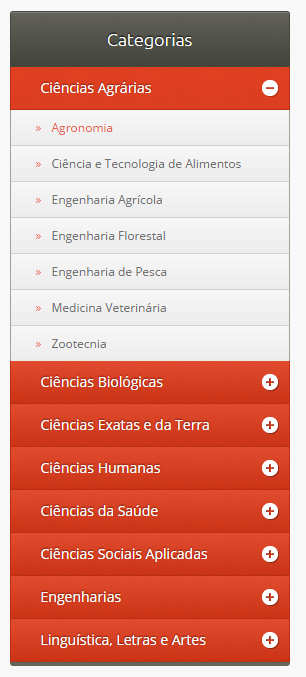

Taxonomy menu with children on Drupal 7
====================================

This module creates block with menus, according to the selected taxonomies.

The block set contains a list of links from a vocabulary with your terms (children).

Only vocabularies which contain terms and sons thats will work.

### Informations
I used the menu displayed on the right sidebar.

The style and javascript were leveraged of [CSSMenumaker][1]

### Demo

[1]: http://cssmenumaker.com/menu/modern-jquery-accordion-menu